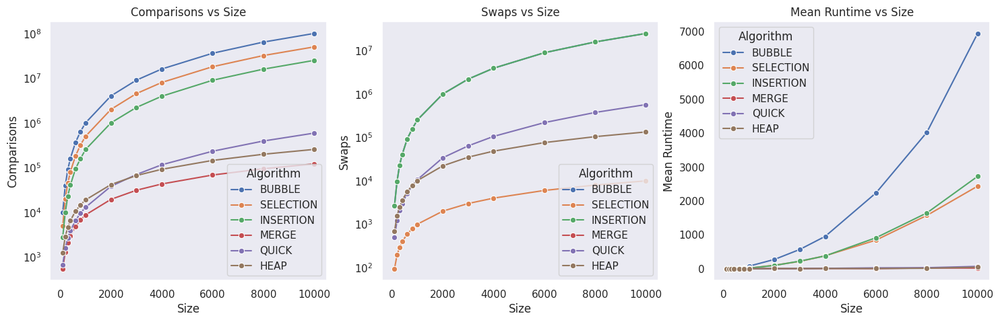

# Sorting Visualizer

A JavaFX-based application for visualizing various sorting algorithms in real-time, complete with performance metrics and algorithm comparisons.

## 1. Core Architecture

### 1.1 Sorting Strategies
The project follows a strategy design pattern where each sorting algorithm implements a common interface. This allows for a decoupled design where the visualization logic is separated from the sorting logic.

#### `SortingStrategy`
The abstract base class for all sorting algorithms. It provides a mechanism for algorithms to report their internal steps (comparisons, swaps, etc.) to a metrics handler.

```java
public abstract class SortingStrategy<E extends Comparable<E>>{

    void addToMetrics(SortingStep<E> step, SortingMetrics<E> metrics) {
        if (metrics != null){
            metrics.addStep(step);
        }
    }
    public abstract List<E> sort(List<E> list, Comparator<E> comparator, SortingMetrics<E> metrics);
    // ... overloads for convenience
}
```

### 1.2 Algorithm Implementations

#### Bubble Sort
A simple comparison-based algorithm that repeatedly steps through the list, compares adjacent elements and swaps them if they are in the wrong order.

```java
public class BubbleSort<E extends Comparable<E>> extends SortingStrategy<E>{
    public List<E> sort(List<E> list, Comparator<E> comparator, SortingMetrics<E> metrics) {
        for (int i = 0; i < list.size(); i++){
            for (int j = 0; j < list.size() - 1; j++){
                super.addToMetrics(new CompareStep<>(j, j + 1), metrics);
                if (comparator.compare(list.get(j + 1),list.get(j)) < 0){
                    Collections.swap(list, j, j + 1);
                    super.addToMetrics(new SwapStep<>(j, j + 1), metrics);
                }
            }
        }
        return list;
    }
}
```

#### Insertion Sort
Builds the final sorted array one item at a time. It is much less efficient on large lists than more advanced algorithms.

```java
public class InsertionSort<E extends Comparable<E>> extends SortingStrategy<E> {
    public List<E> sort(List<E> list, Comparator<E> comparator, SortingMetrics<E> metrics) {
        for (int i = 1; i < list.size(); i++) {
            E pivot = list.get(i);
            int j = i - 1;
            super.addToMetrics(new CompareStep<>(i, j), metrics);
            while (j >=0 && comparator.compare(list.get(j), pivot) > 0) {
                list.set(j+1, list.get(j));
                super.addToMetrics(new CompareStep<>(i, j), metrics);
                super.addToMetrics(new SwapStep<>(j, j + 1), metrics);
                j--;
            }
            if (j != i - 1) {
                list.set(j+1, pivot);
                super.addToMetrics(new SetStep<>(j + 1, pivot), metrics);
            }
        }
        return list;
    }
}
```

#### Selection Sort
In-place comparison-based sorting algorithm. It has O(n²) time complexity, which makes it inefficient on large lists.

```java
public class SelectionSort<E extends Comparable<E>> extends SortingStrategy<E> {
    public List<E> sort(List<E> list, Comparator<E> comparator, SortingMetrics<E> metrics) {
        for (int i = 0; i < list.size(); i++) {
            int bestIndex = i;
            for (int j = i + 1; j < list.size(); j++) {
                super.addToMetrics(new CompareStep<>(j, bestIndex), metrics);
                if (comparator.compare(list.get(j), list.get(bestIndex)) < 0) {
                    bestIndex = j;
                }
            }
            if (bestIndex != i) {
                Collections.swap(list, bestIndex, i);
                super.addToMetrics(new SwapStep<>(bestIndex, i), metrics);
            }
        }
        return list;
    }
}
```

#### Merge Sort (O(n log n))
A divide and conquer algorithm that was invented by John von Neumann in 1945. This implementation writes the result of the merge back into the original array to maintain synchronization with the visualization.

```java
public class MergeSort<E extends Comparable<E>> extends SortingStrategy<E> {
    private void mergesort(List<E> list, int start, int end, ...) {
        if (list == null || start >= end - 1) return;
        int mid = (start + end) / 2;
        mergesort(list, start, mid, ...);
        mergesort(list, mid, end, ...);
        List<E> merged = merge(list, start, mid, end, ...);
        for (int i = start; i < end; i++) {
            list.set(i, merged.get(i - start));
            super.addToMetrics(new SetStep<>(i, merged.get(i - start)), metrics);
        }
    }
}
```

#### Quick Sort (Randomized)
Utilizes the randomized version to significantly reduce the likelihood of encountering the worst-case O(n²) running time.

```java
public class QuickSort<E extends Comparable<E>> extends SortingStrategy<E>{
    private int randomizedPartition(List<E> list, int start, int end, ...) {
        int swapIdx = (int)(Math.random()*((end - 1) - start)) + start;
        Collections.swap(list, swapIdx, end - 1);
        super.addToMetrics(new SwapStep<>(swapIdx, list.size() - 1), metrics);
        return partition(list, start, end, ...);
    }
}
```

#### Heap Sort
Follows the textbook implementation, constructing a max-heap and repeatedly extracting the maximum element.

```java
public class HeapSort<E extends Comparable<E>> extends SortingStrategy<E> {
    @Override
    public List<E> sort(List<E> list, Comparator<E> comparator, SortingMetrics<E> metrics) {
        buildHeap(list, comparator,  metrics);
        for (int i = list.size() - 1; i >= 0; i--) {
            Collections.swap(list,0, i);
            super.addToMetrics(new SwapStep<>(0, i), metrics);
            heapify(list.subList(0,i), comparator, 0,  metrics);
        }
        return list;
    }
}
```

## 2. Metrics & Visualization

### 2.1 `SortingMetrics`
This class tracks all intermediate steps and statistics during the sorting process.

```java
public class SortingMetrics<E> {
    private int comparisonCount;
    private int setCount;
    private int swapCount;
    private final List<SortingStep<E>> steps;

    public void addStep(SortingStep<E> step) {
        if (step instanceof CompareStep<E>) comparisonCount++;
        else if (step instanceof SetStep<E>) setCount++;
        else if (step instanceof SwapStep<E>) swapCount++;
        steps.add(step);
    }
}
```

### 2.2 `SortingStep` (Command Pattern)
Each step (comparison, swap, set) knows how to visualize itself on the UI, separating the sorting logic from the rendering logic.

```java
public interface SortingStep<E> {
    public void visualizeOn(VisualizationBars<E> visualizationBars);
}
```

## 3. Graphical User Interface

### 3.1 `VisualizationBars`
Handles the rendering of data as rectangles. It uses JavaFX property bindings to ensure that changes in data values are automatically reflected in the heights of the bars.

### 3.2 View Controllers

The application consists of three main controllers that manage the user interface and coordinate between the sorting logic and the visualization.

#### `ArrayGenController`
Responsible for generating the target array. It supports multiple generation modes: **Random**, **Sorted**, **Reversed**, and **From File**. For smaller arrays (up to 250 elements), it automatically prepares the `VisualizationBars` for immediate sorting.

```java
public void genVisArray() throws IOException {
    generateArray();
    if (arr.isEmpty()) return;

    if (arr.size() > 250) {
        ArrayVisManager.getInstance().loadSnapshot(arr, visualizationBars);
        goToVisualizeBtn.setDisable(true); // Large arrays are data-only
        toastHeader.setText("Array generated but too large to visualize");
        CommonUtils.showToast(toast, 2);
        return;
    }
    // ... link to visualization bars for small arrays
}
```

#### `SortingController`
Manages the visualization process. It utilizes a separate thread for the sorting logic to prevent the JavaFX Application Thread from hanging during animations. It also handles resetting the array state using a deep-copy constructor in `VisualizationBars`.

```java
@FXML
public void visualizeSort() {
    // ... strategy selection
    new Thread(() -> {
        visualize(metrics.getSteps());
    }).start();
}

public void visualize(List<SortingStep<Integer>> steps) {
    for (int i = 0; i < steps.size(); i++) {
        // ... build Timeline with KeyFrames for each step
    }
    timeline.play();
}
```

#### `ComparisonController`
Provides a benchmarking tool to compare multiple algorithms. It runs each selected algorithm for a specified number of runs and calculates min, max, and mean runtimes, as well as average operation counts.

```java
private void addAlgorithmStats(CheckBox checkBox) {
    // ... run loop
    for (int i = 0; i < runs; i++) {
        long start = System.nanoTime();
        strategy.sort(new ArrayList<>(arr), ..., metrics);
        long end = System.nanoTime();
        double runtime = (end - start)/1e6;
        // ... accumulate metrics
    }
    // ... update TableView with results
}
```

## 4. Performance Analysis

The following graphs show the relationship between input size and runtime across different algorithm categories. As expected, $O(n \log n)$ algorithms (Merge, Quick, Heap) significantly outperform $O(n^2)$ algorithms (Bubble, Insertion, Selection) as the array size grows.



---
*Document produced as part of the Sorting Visualizer project report.*
